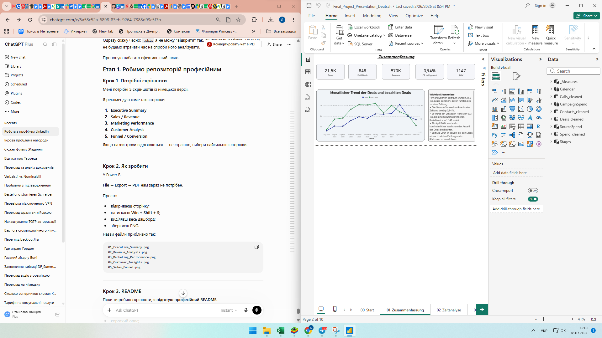
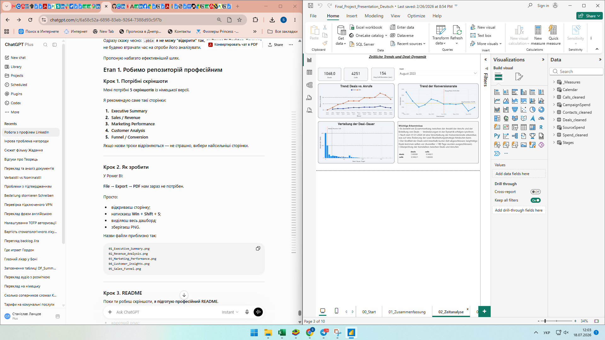
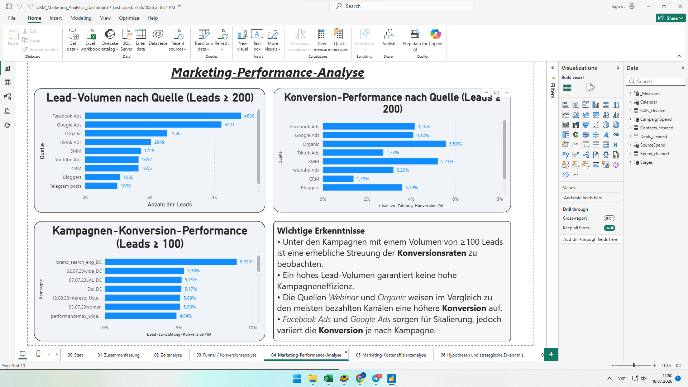
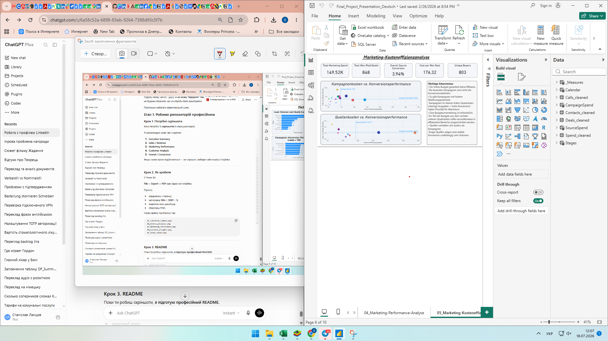

# CRM Marketing Analytics Dashboard

Interactive **Power BI dashboard** for CRM, sales, and marketing performance analysis.

This project presents a German-language analytical dashboard designed to monitor business performance, evaluate marketing channels, analyze customer conversion, and support data-driven decision-making.

## Project Overview

The dashboard analyzes CRM, sales, call center, and marketing data to provide insights into:

- Sales and revenue performance
- Customer acquisition and conversion
- Marketing channel effectiveness
- Campaign cost efficiency
- Deal development over time
- Sales funnel bottlenecks

---

# Dashboard Preview

## 1. Executive Summary

Business KPIs, monthly trends, and executive insights.

---

## 2. Time Analysis

Analysis of deals, calls, conversion rate, and deal duration over time.

---

## 3. Funnel & Conversion Analysis

Conversion analysis across sales stages and funnel performance.

---

## 4. Marketing Performance

Comparison of marketing channels and campaign effectiveness.

---

## 5. Marketing Cost Efficiency

Marketing spend, cost per conversion, and campaign ROI analysis.

---

# Tools Used

- Power BI
- Power Query
- DAX
- Data Modeling
- CRM Analytics
- Marketing Analytics

---

# Skills Demonstrated

- Data Analysis
- Dashboard Design
- KPI Reporting
- Data Visualization
- Marketing Analytics
- CRM Analytics
- Business Intelligence
- DAX
- Power Query
